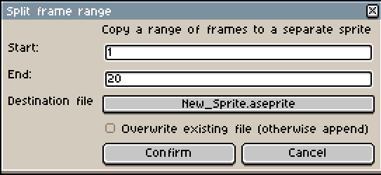

# Aseprite Split & Merge
*WIP/Incomplete*

This is a script that can split and merge frames from one or more [Aseprite](https://www.aseprite.org)
files to another. It preserves any associated tags, layers, and other metadata.

# GUI Usage
1. Copy `split_merge.lua` to [user scripts folder](https://community.aseprite.org/t/locate-user-scripts-folder/2170)
2. Select `File > Scripts > split_merge`



# CLI Usage

## Parameters
* `src-sprite`: Sprite file to copy from; otherwise use active sprite
* `dest-sprite`: Sprite file to copy to; otherwise create new sprite with a default filename
* `start-frame`: Frame to start copying from; default: `1`
* `end-frame`: Frame to stop copying from; default: last frame of `src-sprite`
* `overwrite`: Overwrite an existing file instead of appending to it; default: `false`

## Example
```bash
aseprite -b my_sprite.aseprite \
   --script-param dest-sprite=my_sprite_subset.aseprite \
   --script-param start-frame=1 \
   --script-param end-frame=10 \
   --script-param overwrite=true \
   --script split_merge.lua
```
